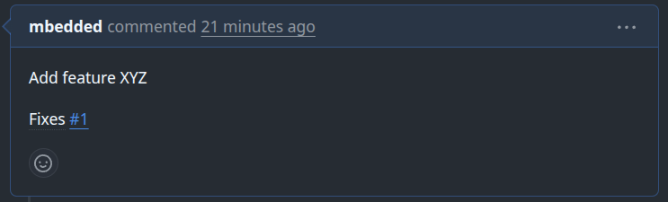

# Contributing

Thank you for your contribution!
This guide helps you to get an overview of the contribution process
and how to contribute to this project.

## Check before doing anything

Is there already an issue or Pull-Request (PR) existing?
Maybe the issue is fixed but not merged (and published) yet.
If you think that some details are missing, please comment on the issue or the PR. 
If it's missing: Create an issue and describe the fix or feature.

We want to avoid duplicates and keep the issues as clean as possible.

> [!NOTE]
> Minor issues and trivial fixes like typos or missing language translations
> can be pushed directly via a PR without creating an issue first.

## Getting Started

- Fork and clone the repository.
- Commit your fixes.
- Push the changes and create a PR.
- Use a meaningful title for the PR like `fix: handle case XY when doing TASK`.
  Please ensure that the origin (issue) is linked like in the following screenshot.

- If you want to add additional information or questions about your PR, feel free to add them.

Additional information can be found in the GitHub-Guide: 
[Contributing to a project](https://docs.github.com/en/get-started/exploring-projects-on-github/contributing-to-a-project)

## Commit Guidelines

This repo uses [Conventional Commits](https://www.conventionalcommits.org/).
Commit message should be structured as follows:

```
feat: Add button to delete user
fix: Handle NULL error when deleting user
```

You may specify a scope to highlight which part of the application is affected by the change.
For example:

```
fix(ui): Increase contrast of button color
feat(database): Add new table to store custom user-data
```

As of writing this (2026-02-08) there are no scopes defined.

## Issue and Pull Request Guidelines


