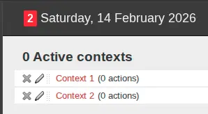
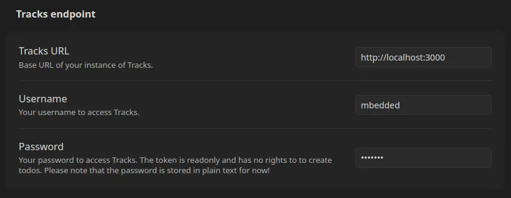

# Tracks
{: .no_toc }

## Table of Contents
{: .no_toc .text-delta }

1. TOC
{:toc}

When using [Tracks](https://www.getontracks.org/) to manage your tasks,
you must either utilize a hosted service or set up a server yourself.
Please refer to the official documentation for instructions on how to install and configure the service.

## Preparation of Tracks

You must have a username and password (or token) for authentication.
Otherwise the plugin is unable to connect to the service.
Additionally, you need to create contexts through the Web UI.

Managing contexts is out of scope for the plugin.
This step has to be done only once.

## Setup plugin in Obsidian

Open the settings in Obsidian and select the entry labeled "Web Task Dashboard".
This entry is located at the bottom under "Community Plugins".

Insert the address, username and password (or token) like in the screenshot below:

{: .warning }
> As of 2026-02-14, the latest GTD release with a specific version number is `tracksapp/tracks:2.7.1`.
> In this version, the token is read-only.
> If you are using version 2.7.1 or any other version where tasks are read-only, you must use your password in Obsidian instead of the token.
> **In the first version of this plugin, the password is stored in plain text!**
> For more details, please refer to [this issue in GitHub](https://github.com/mbedded/obsidian-web-task-dashboard/issues/10).
