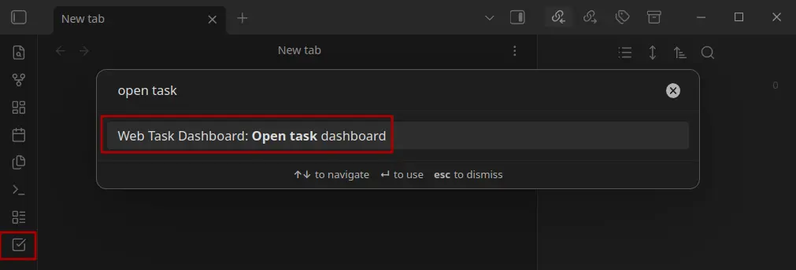

# Get started
{: .no_toc }

## Table of Contents
{: .no_toc .text-delta }

1. TOC
{:toc}

## Before you start

Verify that the plugin is [installed]() correctly
and that you have [set up the correct backend]() configuration.

## Open the dashboard

The dashboard can be opened in the following ways:

- Use the command palette to execute "Open Task Dashboard".
- Click the "Open Task Dashboard" button located in the left sidebar.

## Structure and layout of the
